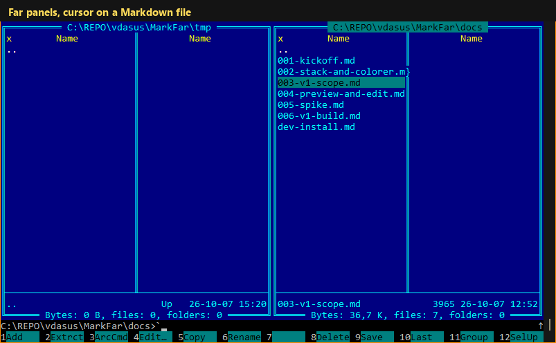

# MarkFar

A Markdown preview plugin for [Far Manager 3](https://www.farmanager.com/):
open a `.md` file and read it rendered, with syntax highlighting, inside Far.



Requires Far Manager 3 x64 (tested with build 6699). Colorer, which ships
with Far, colours the code blocks.

## Install

1. **Download** `MarkFar-<version>-x64.zip` from
   [Releases](https://github.com/vdasus/MarkFar/releases/latest).
2. **Close Far Manager.**
3. **Unpack** the zip. It contains one folder, `MarkFar`. Copy that folder
   into the plugins folder of your Far profile:

   ```
   %APPDATA%\Far Manager\Profile\Plugins
   ```

   (paste the line into the Explorer address bar; create `Plugins` if it
   does not exist). The result is
   `%APPDATA%\Far Manager\Profile\Plugins\MarkFar\MarkFar.dll`.
   No administrator rights are needed.
4. **Start Far.** `F11` now lists "MarkFar".

Two optional steps, each done once:

5. **Colour code blocks** (` ```sql `, ` ```csharp `, ...):
   1. `F9` → `Options` → `Plugins configuration` → `FarColorer` → `Enter`.
   2. In the field **Custom schemas folder (hrc)** enter the full path of the
      plugin's `hrc` folder, for example
      `C:\Users\<you>\AppData\Roaming\Far Manager\Profile\Plugins\MarkFar\hrc`.
   3. Press **OK**. If the field already holds another folder, copy
      `MarkFar\hrc\markfar.hrc` into that folder instead.
6. **Open `.md` files with `F3`:**
   1. `F9` → `Commands` → `File associations` → `Ins`.
   2. **Mask:** `*.md`
   3. Tick **View command (used for F3)** and enter `markfar:!\!.!`
   4. Leave the other commands empty, press **OK**. If another association
      already matches `*.md`, move the new one above it.

   `Alt+F3` still opens Far's own viewer. Delete the association to undo.

**Update:** close Far, replace the `MarkFar` folder with the new one, start
Far. **Remove:** close Far, delete the folder (and the association).

## Use

| Key | In the preview |
|---|---|
| `F2` | Word wrap on/off |
| `F6` | Switch to the file in Far's editor; `F6` there (or `Esc` after saving) returns to the updated preview |
| `Ctrl+Down` / `Ctrl+Up` | Next / previous heading |
| `Esc` | Close |
| `F1` | Help |

Settings: `F9` → `Options` → `Plugins configuration` → `MarkFar`. Help:
`F1` in the preview, in English, Russian and Lithuanian.

Building from source: [docs/dev-install.md](docs/dev-install.md). Design
notes: [docs/](docs/).

## Third-party code

- [md4c](https://github.com/mity/md4c) 0.6.0, MIT license
  (`third_party/md4c`).
- Far Manager plugin SDK headers, BSD 3-Clause license (`sdk/`).

## Authorship

The code and documentation in this repository are written by Claude (an AI
model by Anthropic) under the supervision of vdasus, who sets the
direction, reviews the work and decides what goes in.

## License and disclaimer

Released under the [BSD Zero Clause License](LICENSE) (0BSD): use, copy,
modify and distribute it for any purpose, with or without fee, without any
obligation, including attribution.

The software is provided "as is", without warranty of any kind. The author
accepts no responsibility or liability for any damage, data loss or other
consequences of using it. Use it at your own risk.
